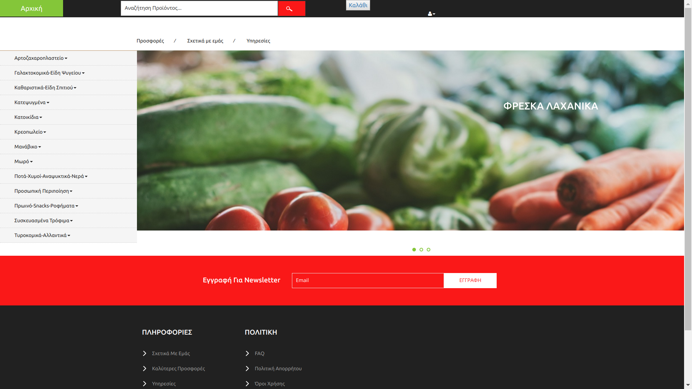
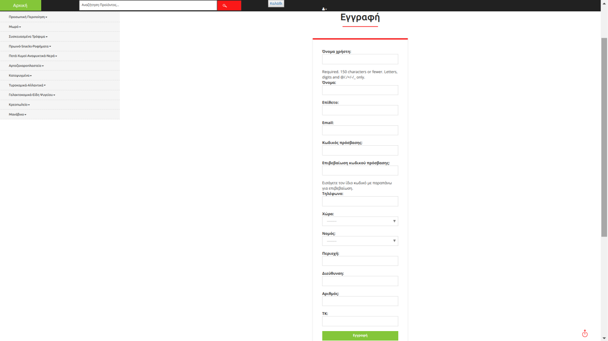
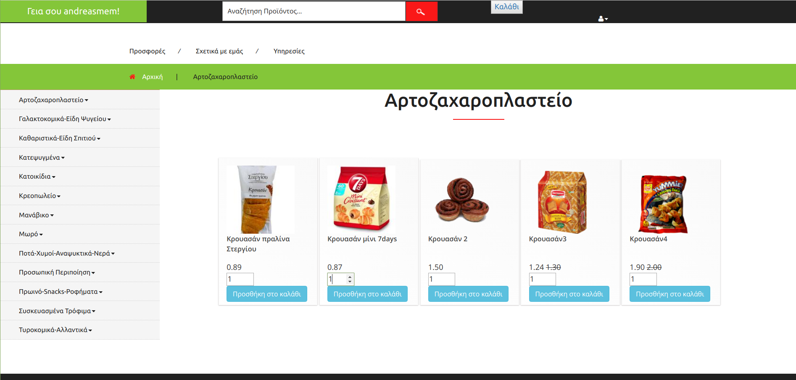
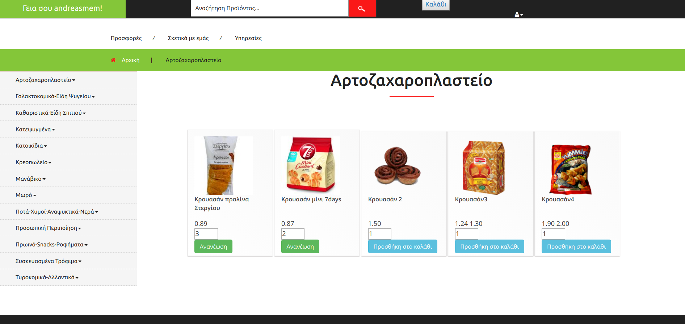
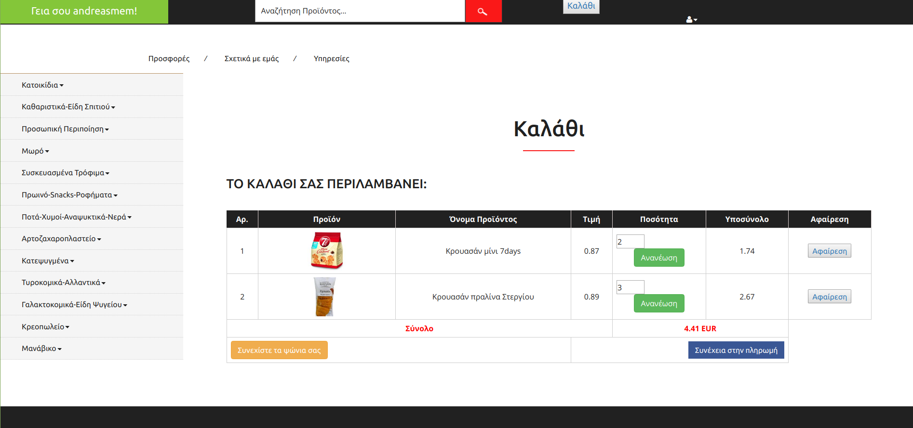
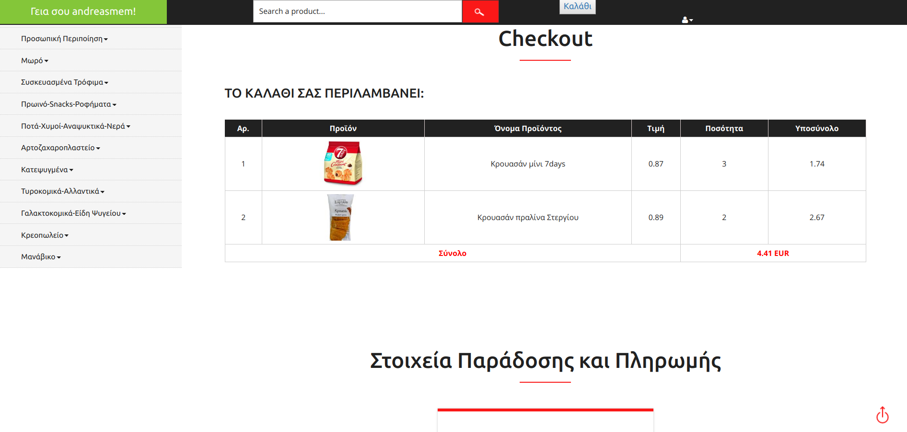
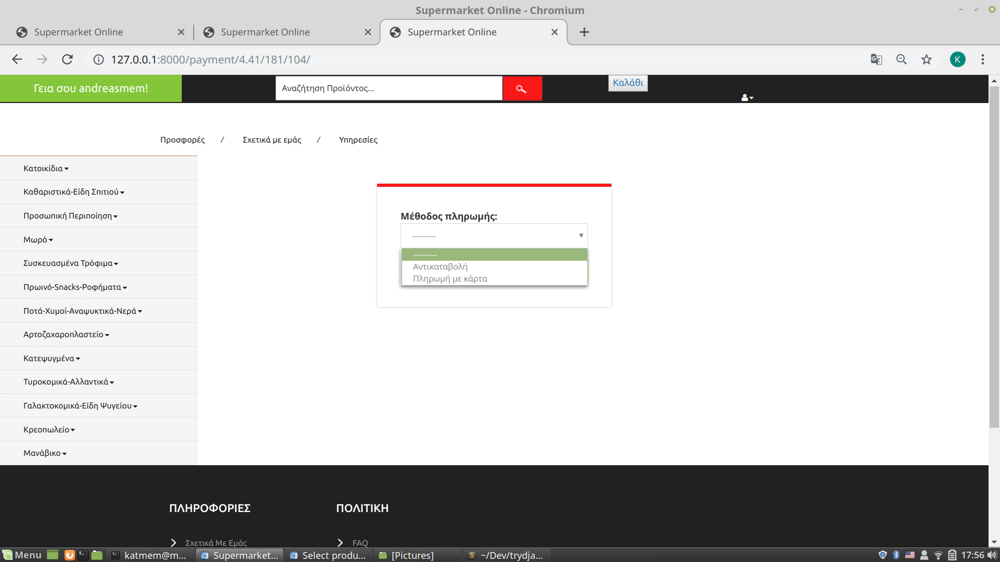
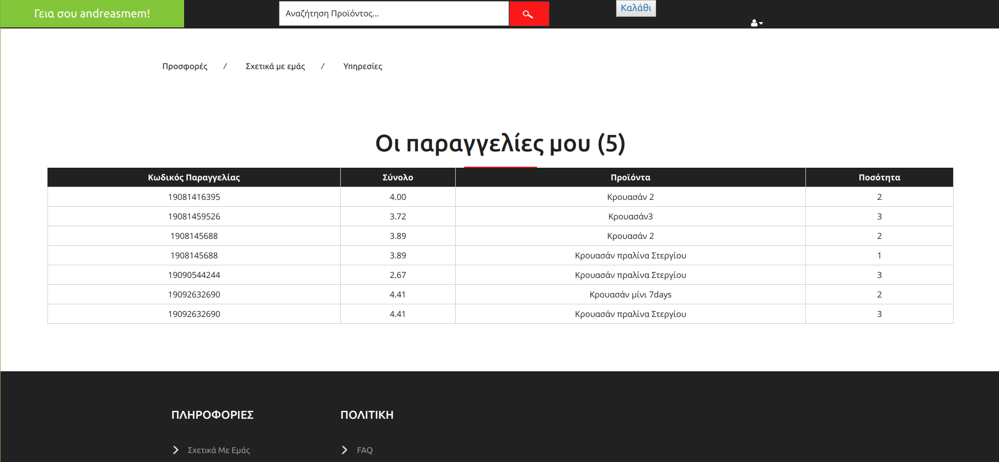

# Easy Grocery - A web application for ordering groceries
Easy Grocery was developed with Django, PostgreSQL, HTML and CSS and it allows users to order groceries from a supermarket and have them delivered to their house. Products are seperated in categories and subcategories, and users can register, add products to the cart, increase/decrease the quantity, choose to pay by cash or card, enter their address details for the delivery of the products and view their order history.

## Screenshots

Homepage

User registration

Users can view the products of a category, e.g."Bakery" products

Users can choose the quantity of a product and add it to the cart

They can also view the cart and add or remove items from it, or adjust the quantity of an item

When they click "Proceed to payment", they are redirected to a page where they see the cart overview and they can add their address details

After clicking "Continue", they can choose the payment method (cash or card)

Users can also view the history of their previous orders

